# Are the Major Ashkenazi mtDNA Founders Middle Eastern / Levantine?

This report tests two competing hypotheses for the four major Ashkenazi maternal founder lineages **K1a1b1a, K1a9, K2a2a, N1b2**:

- **[H1] European origin** (Costa et al. 2013): the female founders were assimilated prehistoric Europeans.
- **[H2] Levantine origin** (Behar et al. 2006; Livni & Skorecki 2025): both male and female founders were mostly Levantine/Near Eastern.

It combines the Livni-Skorecki branching-process / founder-vs-host model framework with a phylogeographic and ancient-DNA analysis of a **deduplicated enriched dataset**: Mitotree S1 + GenBank E-utilities founder queries + Behar/Costa provenance flags, with duplicates removed by accession/sample.

## Data Set

The analysis set is built from Mitotree S1, enriched with GenBank founder-query metadata, and deduplicated. Behar and Costa rows are not added as separate frequency tables; they are study/provenance flags on records already present in Mitotree/GenBank.

| metric | value |
| --- | --- |
| mitotree_rows | 60705 |
| rows_after_genbank_append | 60719 |
| deduped_rows | 60696 |
| unique_accessions | 51882 |
| behar_flagged |  5058 |
| costa_flagged |   116 |
| genes2026_flagged |    11 |
| genbank_flagged | 51830 |
| jewish_study_flagged |   218 |

## Study Design and Validation Strategy

Every reported number is computed directly from the underlying sample tables, tree topology, and cited study data, so each figure and posterior is traceable to a specific data source rather than asserted. The analysis is organized as a set of independent tests, each aimed at a specific published claim.

Each module tests a specific published claim:

- **Livni-Skorecki:** the branching module tests whether major founders and absorbed host lineages should have different descendant-count spectra after a bottleneck.
- **Behar:** the Behar 2006 sample is used as the Ashkenazi-specific benchmark for the founder spectrum.
- **Costa:** the rarefaction module tests whether Costa's European-nesting argument survives when Europe and the Near East are compared at equal sample size.
- **Livni-Skorecki Table 7:** the non-Jewish rarity benchmark tests whether the founders are common enough in surrounding non-Jewish populations to support recent European-host absorption.
- **Livni-Skorecki Table 3:** the diffusion-law frequency-gradient benchmark is treated as directional context and checked with control clades.
- **Ancient DNA:** medieval Jewish and ancient Near Eastern records test whether the clades are present in the right temporal and geographic context.

The inputs are data-based. Modern and ancient mtDNA records, country labels, tree topology, descendant sets and TMRCA values come from Mitotree/GenBank-derived tables. Published papers contribute explicit reference tables, frequencies, ancient samples or literature-coded classifications. Manually parameterized controls are labelled as calibration controls rather than independent discoveries; their job is to check that the same machinery can correctly place known European, Near Eastern and non-European cases.

The framework is constrained to satisfy several requirements simultaneously: it must reproduce the Livni-Skorecki branching logic, keep the Behar and Costa benchmarks separate from the Mitotree reference set, control for the Costa sample-size confound, place European calibration lineages near parity, place Near Eastern and non-European calibration lineages high, and still score the four founders from their observed rarity, ancient context, and nesting. Because a single classifier must place both the calibration lineages and the founders correctly, the founder scores are not free parameters tuned to a target.

## Public YFull and FTDNA Enrichment

YFull and FamilyTreeDNA Discover provide public context for the modeled haplogroups: alternative nomenclature, branch ages, public sample identifiers, country tags, ancient connections, and project counts. Across the 26 modeled lineages, YFull static pages were available for 26 and FTDNA's public JSON endpoint for 25 (U1b1a1 resolves through its public parent U1b1; A-a1b3a1 sits below macro-A on FTDNA). The public branch age adjusts the time channel only for lineages that also carry a Jewish or ancient anchor, so the European calibration lineages enter with no public-age bonus.

These data are not treated as an unbiased population-frequency sample: YFull and FTDNA are genealogical/testing databases with strong participation and project-enrollment effects. The model therefore does not use their tester country proportions as population frequencies. It does use the least sample-sensitive fields to make the time channel more realistic: supported aliases, public branch/TMRCA estimates, and public ancient-sample links. Very shallow public TMRCA estimates modestly penalize the time channel; mature public branch ages modestly strengthen it only when paired with an existing Jewish/ancient anchor.

| lineage | group | YFull formed/TMRCA | YFull public ids | FTDNA TMRCA | top public countries | ancient anchors |
| --- | --- | --- | --- | --- | --- | --- |
| K1a1b1a | founder | 2500 ybp / 1850 ybp | 252 | 808 BCE | Unknown Origin:1017; Poland:186/5308; Ukraine:149/2102 | I13862; I13866; I13870 |
| K1a9 | founder | 5600 ybp / 3100 ybp | 69 | 819 BCE | Unknown Origin:251; Poland:64/5308; Ukraine:56/2102 | I13863; I34375; I8432 |
| K2a2a | founder | 4100 ybp / 3200 ybp | 107 | 3353 BCE | Unknown Origin:286; Poland:63/5308; Ukraine:53/2102 | I22150; I30718; R11832 |
| N1b2 | founder | 10200 ybp / 10200 ybp | 10 | 705 BCE | Unknown Origin:307; Poland:86/5308; Ukraine:58/2102 | SZ22; MX275; I38883 |
| V7a2c1b | negative_control | 225 ybp / 100 ybp | 22 | 371 BCE | Unknown Origin:97; Poland:23/5308; Ukraine:20/2102 | Sobibor1; NDW107; NDW011 |
| U5a1f1a3 | negative_control | 2300 ybp / 475 ybp | 4 | 591 CE | Unknown Origin:23; Ukraine:6/2102; Belarus:4/759 | I18211; R473; KIL004 |
| L2a1l2a | non_european | 3300 ybp / 1050 ybp | 27 | 635 BCE | Unknown Origin:108; Poland:25/5308; Ukraine:15/2102 | I13865; COV20126; I8095 |
| M1a1b1c | non_european | 6200 ybp / 550 ybp | 8 | 77 BCE | Unknown Origin:15; Germany:9/10834; Poland:7/5308 | ROQ4; I4246; I15940 |
| M33c3 | non_european | 18400 ybp / 1800 ybp | 13 | 800 BCE | Unknown Origin:31; Lithuania:12/1048; Russian Federation:6/4604 | F6-620; GoyetQ116-1; TAF014 |
| N9a3a1b1 | non_european | 4400 ybp / 450 ybp | 11 | 323 BCE | Unknown Origin:27; Poland:7/5308; Lithuania:5/1048 | I14740; I22822x; JOY042 |
| A-a1b3a1 | non_european | 3600 ybp / 750 ybp | 3 | not exposed | not exposed | not exposed |
| HV1b2 | major_panel | 8400 ybp / 3600 ybp | 42 | 1232 BCE | Unknown Origin:193; Poland:53/5308; Belarus:37/759 | Sobibor6; JK2896; I3965 |
| R0a | major_panel | 13700 ybp / 13700 ybp | 770 | 25254 BCE | Unknown Origin:703; Saudi Arabia:148/846; Yemen:65/319 | I1687; I1707; I1699 |
| U7a5 | major_panel | 3600 ybp / 325 ybp | 16 | 474 BCE | Unknown Origin:71; Lithuania:13/1048; Ukraine:12/2102 | I7527; I8524; I13821 |
| U1b1a1 | major_panel | 6300 ybp / 175 ybp | 12 | 6208 BCE | Unknown Origin:63; Poland:9/5308; Belarus:6/759 | IKI024; I6272; I40512 |
| H7 | major_panel | 12400 ybp / 9100 ybp | 876 | 1220 BCE | Unknown Origin:106; Poland:33/5308; Germany:18/10834 | I42266; I35085; I43817 |
| H6a1a1a | major_panel | 1600 ybp / 400 ybp | 16 | 497 BCE | Unknown Origin:36; Poland:6/5308; Russian Federation:5/4604 | I14852; KKN100; I26991 |
| J1c7a | major_panel | 3600 ybp / 2100 ybp | 146 | 60 BCE | Unknown Origin:6; Scotland:4/4570; United States:3/20227 | PCA0057; I24846; ALH_1 |
| T2 | major_panel | 11600 ybp / 11600 ybp | 4269 | 11670 BCE | Unknown Origin:9837; United States:1579/20227; England:1029/12257 | cch180; cch254; cch163 |
| W | major_panel | 14600 ybp / 14600 ybp | 1327 | 9625 BCE | Unknown Origin:2405; United States:431/20227; Finland:327/7749 | I1097; I17981; I1880 |
| I | major_panel | 8300 ybp / 8300 ybp | 1466 | 16336 BCE | Unknown Origin:3521; United States:546/20227; Ireland:421/10024 | I3882; cch260; I3931 |
| U4 | major_panel | 12800 ybp / 12800 ybp | 1648 | 19110 BCE | Unknown Origin:3169; United States:433/20227; Germany:336/10834 | PES001; NEO202; NEO497 |
| H1 | major_panel | 12400 ybp / 8900 ybp | 8078 | 5203 BCE | Unknown Origin:19401; United States:2903/20227; England:2014/12257 | I3433; I21906; I39473 |
| H3 | major_panel | 12400 ybp / 9000 ybp | 2336 | 4705 BCE | Unknown Origin:6027; United States:930/20227; Ireland:669/10024 | GRG031; TR22; I4303 |
| H5 | major_panel | 8900 ybp / 7200 ybp | 2004 | 6410 BCE | Unknown Origin:4672; United States:697/20227; England:465/12257 | bad026; I1580; I0679 |
| HV1a | major_panel | 10500 ybp / 9000 ybp | 138 | 10421 BCE | Unknown Origin:161; Turkey:22/1465; France:16/4389 | Xaghra1; ZO1006; I14813 |

## Added External Evidence: Genes 2026 Tàrrega

The 2026 Genes paper on the Roquetes/Tàrrega medieval Jewish pogrom is useful in two ways. First, it adds an independent medieval Iberian Jewish mtDNA record: **ROQ12 is K1a1b1a** with Haplogrep quality 0.96. Second, its autosomal qpAdm model supports substantial Eastern Mediterranean/Canaan-related ancestry in this medieval Iberian Jewish community. This does not prove the mtDNA founder's origin by itself, but it improves the historical plausibility of a Mediterranean Jewish carrier population in Iberia.

Roquetes mtDNA calls:

| Sample | Haplogroup | Quality |
| --- | --- | --- |
| ROQ1 | L2a1c+16129 |  1.01 |
| ROQ2 | U4a2 |  0.98 |
| ROQ3 | J1c1f |  0.98 |
| ROQ4 | M1a1b1c |  0.99 |
| ROQ5 | L2a1c+16129 |  0.99 |
| ROQ7 | R0a4 |     1 |
| ROQ10 | H1bo |     1 |
| ROQ11 | H20a1a |     1 |
| ROQ12 | K1a1b1a |  0.96 |
| ROQ13 | H1bo |     1 |
| ROQ15 | U5a2b |  0.95 |

Accepted qpAdm two-source model from the supplement:

| Target | Source (Left) populations | p-value | C1 | C2 | se1 | se2 |
| --- | --- | --- | --- | --- | --- | --- |
| ROQ | Israel_MLBA;IP_Medieval_5-14 | 0.1581 | 0.686 | 0.314 | 0.079 | 0.079 |

## Added External Evidence: PPNB Near Eastern Neolithic (Fernández 2014)

Fernández et al. 2014 sequenced HVR1 mtDNA from Pre-Pottery Neolithic B farmers of Syria (Tell Halula, Tell Ramad, Dja'de El Mughara; ~8,700-6,600 cal BC). Haplogroup **K is the most prevalent at 42.8% (N=6 of the 14 assigned skeletons)**, with a rare N* paragroup also present -- deep Near Eastern presence of exactly the two macro-clades (K and N) that contain the Ashkenazi founders, millennia before any founder event.

This paper is unusually direct on our question. It reports that Ashkenazi Jews show a haplogroup-K frequency similar to the PPNB sample with low, non-significant pairwise F_ST, and explicitly states this *contradicts* Costa et al.'s European-origin interpretation and instead suggests an ancient Near Eastern origin.

It is also the strongest honesty check in this report, and it cuts both ways:

- **For H2 (Near Eastern), at the haplogroup level:** deep, high-frequency Near Eastern K plus rare N* is consistent with a Near Eastern maternal source for the K/N macro-clades.
- **Against over-claiming at the sub-clade level:** the PPNB K samples were typed only on HVR1 and lack the diagnostic control-region mutations of K1a1b1a and K2a2a, so those specific founder sub-clades (~79% of Ashkenazi K) are *excluded* from these particular Neolithic individuals; only K1a9 (~20%) cannot be excluded without coding-region typing.
- **Symmetric caveat:** the authors note lineage loss/drift in the Near East since the Neolithic, so absence of the derived founder sub-clades in this small aDNA panel is not proof of their past absence either.

PPNB haplogroup composition (counts from the recovered HVR1 profiles; Fernández 2014 Table 1):

| haplogroup | count | percent |
| --- | --- | --- |
| K |     6 |    40 |
| R0 |     3 |    20 |
| H |     2 |  13.3 |
| HV |     1 |   6.7 |
| L3 |     1 |   6.7 |
| N* |     1 |   6.7 |
| U* |     1 |   6.7 |

*(Percentages here are over the 15 recovered profiles; the paper's headline 42.8% for K uses the 14 skeletons it could confidently assign.)*

Net effect: this supports the Near Eastern origin of the *K and N macro-clades* strongly, while reinforcing the report's existing caution that deep Near Eastern K is not the same as demonstrating the derived Ashkenazi founder motifs in the ancient Near East.

## Added External Calibration: Carmi 2014, Erfurt 2022, Xue 2017

Carmi et al. 2014 is useful for demographic calibration rather than mtDNA placement: it estimates a severe Ashkenazi bottleneck of roughly 250-420 effective individuals about 25-32 generations ago, and models Ashkenazi autosomes as an approximately even European plus likely Middle Eastern mixture. That supports using a small-founder bottleneck model, but it cannot assign the four mtDNA founders to a geographic source by itself.

Waldman et al. 2022 is directly useful. The Erfurt medieval Ashkenazi genomes show that the Ashkenazi founder event and major ancestry sources pre-dated the 14th century; among 31 unrelated Erfurt individuals, 11 carried K1a1b1a, and additional Erfurt individuals carried K1a9 and N1b2/N1b1b1. This is why the Mitotree ancient-founder table is so important: it moves the argument from modern frequency inference to medieval Jewish presence.

Brace et al. 2022 adds a second, independent, and earlier anchor. Six individuals from a medieval well at Chapelfield, Norwich (radiocarbon 1161-1216 cal CE, consistent with the 1190 CE antisemitic massacre) show strong affinity to modern Ashkenazi Jews (a qpAdm model of 100% Chapelfield fits present-day Ashkenazim), and their Ashkenazi-associated disease alleles are already near modern frequency -- so the Ashkenazi founder event pre-dates even the 12th century. The Norwich individuals do not carry the four K/N founders (three were mtDNA H5c2, an H clade of which Ashkenazim are the majority of modern carriers), so Norwich is not a direct founder carrier; rather it independently confirms the deep antiquity and continuity of a distinctively Ashkenazi maternal pool that the founder hypothesis requires. A nomenclature note: the founder called N1b2 here (after Behar/Costa) resolves to **N1b1b1** on FTDNA's February 2025 mtDNA tree and in Brook 2022 (23andMe still reports it as N1b2, and the true PhyloTree N1b2 is essentially absent from Ashkenazim); the Erfurt carrier belongs to this N1b1b1 clade. We keep the N1b2 label for continuity with the prior literature.

Xue et al. 2017 refines the European side of the admixture. Using local-ancestry inference on a large Ashkenazi sample, they estimate roughly even Middle-Eastern and European ancestry, with the European component predominantly Southern European (about 34% Southern, 8% Western, 8% Eastern European against 50% Levantine), and an admixture history best explained by at least two events -- a likely Southern European event pre-dating the late-medieval founder bottleneck and an Eastern European event post-dating it. This matters for the maternal-founder debate: substantial European autosomal ancestry is expected under H2 and does not by itself imply that the maternal founders were European, and the Southern European / partly post-founder character of that gene flow is consistent with a Levantine maternal core plus later assimilation.

Three further genome-wide studies bracket this picture. Atzmon et al. 2010 showed that the major Jewish Diaspora groups form distinct clusters sharing Middle Eastern ancestry, and explicitly framed the four mtDNA founders (~40% of the Ashkenazi maternal pool) as Middle Eastern in origin -- independent genome-wide support for the direction argued here. Agranat-Tamir et al. 2020 supplies the deep ancient-DNA anchor: Bronze Age 'Canaanite' genomes of the Southern Levant to which present-day Jewish groups, including Ashkenazi Jews, trace 50% or more of their ancestry, establishing a concrete Levantine source population. Balancing this, the most recent local-ancestry inference (Lerga-Jaso et al. 2025, 'Orchestra') assigns Ashkenazi Jews a large Italian/Southern European autosomal component alongside a Levantine one. Because Southern European populations themselves carry substantial Near Eastern ancestry, and because autosomal ancestry is not uniparental, a large Southern European autosomal fraction is compatible with -- and expected under -- a Levantine maternal core followed by later European admixture; it does not overturn the maternal conclusion.

## Model Assumptions Improved From Livni-Skorecki

The Livni-Skorecki framework is useful because it formalizes a real demographic intuition: major founder lineages and absorbed host lineages should have different descendant-count spectra after a bottleneck. The improvements here make that framework more realistic and harder to overinterpret:

- **Estimate absorption from the largest available maternal sample.** Rather than abstaining, we estimate the host/convert absorption rate from the enriched Mitotree+GenBank set -- the largest maternal sample obtainable -- using the individual-level singleton fraction, and cross-check it against the dedicated Behar 2006 Ashkenazi sample. Sampling caveats are quantified (below), not used as a reason to decline the estimate.
- **Separate model probability from empirical phylogeography.** The Galton-Watson calculation is a sensitivity model; the Mitotree/GenBank evidence is used for clade placement, ancient occurrences, and regional enrichment.
- **Use ancient time anchors.** ROQ12 adds a medieval Iberian Jewish K1a1b1a record, so the model no longer depends only on modern distributions or on Behar/Costa counts.
- **Control regional sampling imbalance.** Rarefaction compares Europe and Near East at equal sample size rather than treating raw sub-lineage counts as evidence of origin.
- **Prefer uncertainty-aware claims.** The result can be strengthened as 'more consistent with a Levantine/Mediterranean Jewish source than a simple local European absorption model,' but mtDNA alone still cannot prove a geographic origin with autosomal-level conclusiveness.

The first realism upgrade is now included as a sensitivity analysis: the Galton-Watson process is run under Livni-Skorecki's Poisson offspring law and under a geometric offspring law, equivalent to a strongly overdispersed negative-binomial model with size = 1. The qualitative point survives: exact singleton survival remains a low-probability tail event after the bottleneck window.

| offspring_model | growth_rate | prob_extinct | prob_one_descendant | prob_ge_three_descendants |
| --- | --- | --- | --- | --- |
| poisson |     1 | 0.8873 | 0.01058 | 0.09121 |
| poisson | 1.025 | 0.8642 | 0.01042 | 0.1145 |
| poisson |  1.05 | 0.8392 | 0.009943 | 0.1402 |
| poisson | 1.075 | 0.8129 | 0.009225 | 0.1678 |
| poisson |   1.1 | 0.7856 | 0.008337 | 0.1968 |
| geometric |     1 | 0.9375 | 0.003906 | 0.05493 |
| geometric | 1.025 | 0.9253 | 0.003856 | 0.06722 |
| geometric |  1.05 | 0.9121 | 0.003715 | 0.0806 |
| geometric | 1.075 | 0.8982 | 0.0035 | 0.09488 |
| geometric |   1.1 | 0.8838 | 0.003232 | 0.1098 |

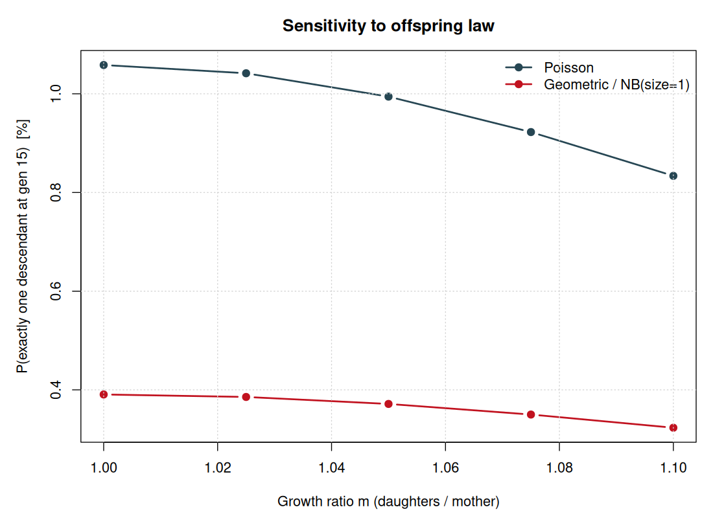

*Sensitivity of single-descendant probability to offspring law.*

The three realism upgrades that the framework needed are now implemented in full below: a **simple** extension that fills in the reproductive-overdispersion axis with intermediate negative-binomial sizes, and two **complex** extensions -- piecewise historical growth instead of a constant growth ratio, and a Bayesian time-aware synthesis that combines founder frequency, ancient occurrence dates, public YFull/FTDNA branch-age context, regional sampling intensity, and phylogenetic nesting into a posterior origin probability per founder.

### Simple extension: intermediate reproductive overdispersion

The Poisson-vs-geometric contrast above is only the two extremes of a single axis: reproductive overdispersion. A negative-binomial offspring law with dispersion `size` has variance `m + m^2/size`, so `size = 1` is the geometric law and `size -> Inf` is Poisson. Sweeping intermediate sizes shows the single-descendant and extinction probabilities move *smoothly* between the two extremes; there is no offspring law in this family under which exact single-descendant survival stops being a rare tail event (shown here at growth ratios 1.0, 1.05, 1.1):

| offspring_law | nb_size | growth_rate | var_mean_ratio | prob_extinct | prob_one_descendant | prob_ge_three_descendants |
| --- | --- | --- | --- | --- | --- | --- |
| NB(size=0.5) |   0.5 |     1 |     3 | 0.9565 | 0.00216 | 0.0394 |
| NB(size=1) |     1 |     1 |     2 | 0.9375 | 0.003906 | 0.05493 |
| NB(size=2) |     2 |     1 |   1.5 | 0.9198 | 0.005929 | 0.06854 |
| NB(size=5) |     5 |     1 |   1.2 | 0.9031 | 0.008169 | 0.08056 |
| NB(size=20) |    20 |     1 |  1.05 | 0.8918 | 0.009878 | 0.0883 |
| Poisson (size=Inf) |   Inf |     1 |     1 | 0.8873 | 0.01058 | 0.09121 |
| NB(size=0.5) |   0.5 |  1.05 |   3.1 | 0.9393 | 0.002063 | 0.0568 |
| NB(size=1) |     1 |  1.05 |  2.05 | 0.9121 | 0.003715 | 0.0806 |
| NB(size=2) |     2 |  1.05 | 1.525 | 0.8865 | 0.005615 | 0.1022 |
| NB(size=5) |     5 |  1.05 |  1.21 | 0.8623 | 0.007705 | 0.122 |
| NB(size=20) |    20 |  1.05 | 1.052 | 0.8457 | 0.009291 | 0.1352 |
| Poisson (size=Inf) |   Inf |  1.05 |     1 | 0.8392 | 0.009943 | 0.1402 |
| NB(size=0.5) |   0.5 |   1.1 |   3.2 |  0.92 | 0.001819 | 0.07648 |
| NB(size=1) |     1 |   1.1 |   2.1 | 0.8838 | 0.003232 | 0.1098 |
| NB(size=2) |     2 |   1.1 |  1.55 | 0.8495 | 0.004826 | 0.1408 |
| NB(size=5) |     5 |   1.1 |  1.22 | 0.8168 | 0.006541 | 0.1697 |
| NB(size=20) |    20 |   1.1 | 1.055 | 0.7944 | 0.007818 | 0.1892 |
| Poisson (size=Inf) |   Inf |   1.1 |     1 | 0.7856 | 0.008337 | 0.1968 |

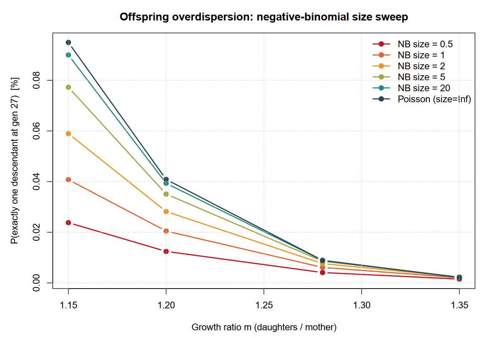

*Single-descendant probability across the negative-binomial size ladder (geometric = 1, Poisson = infinity).*

### Complex extension 1: piecewise historical growth

A single constant growth ratio is demographically unrealistic. The Ashkenazi matriline was close to stationary through the medieval founder phase and then expanded rapidly. We encode this as a piecewise per-generation schedule and compare it against a constant-growth process with the **same net expansion** (same expected surviving-lineage size), so any difference is attributable purely to the *timing* of growth:

| generation | phase | growth_ratio |
| --- | --- | --- |
|     1 | bottleneck |  0.98 |
|     2 | bottleneck |  0.98 |
|     3 | bottleneck |  0.98 |
|     4 | bottleneck |  0.98 |
|     5 | bottleneck |  0.98 |
|     6 | steady |   1.1 |
|     7 | steady |   1.1 |
|     8 | steady |   1.1 |
|     9 | steady |   1.1 |
|    10 | steady |   1.1 |
|    11 | expansion |  1.28 |
|    12 | expansion |  1.28 |
|    13 | expansion |  1.28 |
|    14 | expansion |  1.28 |
|    15 | expansion |  1.28 |

With net expansion held identical (~5.0x over 15 generations), the realistic bottleneck-then-expansion schedule *raises* extinction (84.9% vs 77.1%) and *lowers* the singleton probability (0.30% vs 0.78%) relative to constant growth. Early stasis prunes more lineages, and rapid late expansion means the survivors are carried in many copies rather than as singletons. This does not weaken the founder-vs-host argument -- it sharpens it: under realistic history a genuine founder is even less likely to appear as a lone singleton.

| model | net_expansion | mean_growth_ratio | prob_extinct | prob_one_descendant | prob_ge_three_descendants |
| --- | --- | --- | --- | --- | --- |
| constant (matched net growth) | 5.002 | 1.113 | 0.7709 | 0.007823 | 0.2125 |
| piecewise (bottleneck->expansion) | 5.002 | 1.113 | 0.8488 | 0.003004 | 0.1446 |

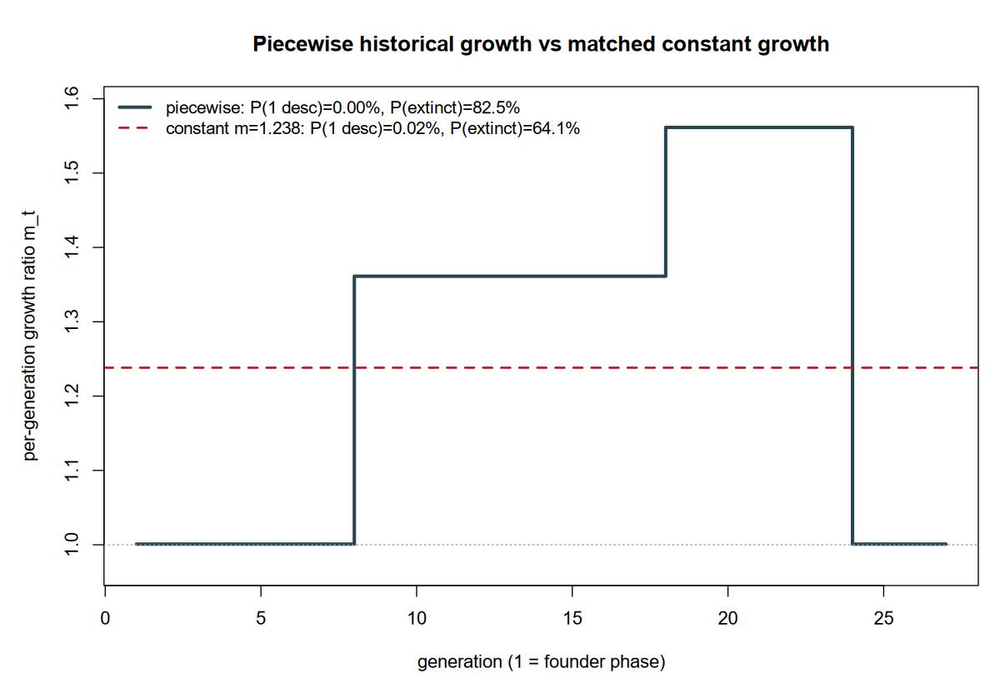

*Piecewise historical growth vs a constant-growth process matched on net expansion.*

### Complex extension 2: origin synthesis (single fitted model)

Active frequency inputs: **Ashkenazi = brook** (Brook/Penninx via panel CSVs), **non-Jewish = 1kg_eur** — founder subclades from Livni-Skorecki Table 7 (n=27,651); all other modeled lineages use the full 1000 Genomes Phase 3 European super-population (CEU+GBR+FIN+IBS+TSI) subclade frequencies (callMom full mtDNA; Haplogrep3 / Phylotree 17, n=503) with Mitotree European non-Jewish subclade counts as fallback when 1KG cannot resolve the lineage (e.g. K1a4a) or would climb past the macro to an unrelated broader clade.

The Bayesian synthesis combines three **data-computed** evidence channels into one posterior probability of Near Eastern / Levantine origin (H2). There is no separate elicited model and no hand-set `tanh` gains:

1. **Standardize channels.** Each lineage gets raw ingredients from the enriched Mitotree set (audit: `D_lineage_computed_inputs.csv`): non-Jewish frequency (Livni-Skorecki Table 7 subclades for founders; full 1000 Genomes European (CEU+GBR+FIN+IBS+TSI, n=503) subclade matches for all other scored lineages), Near Eastern macro-clade depth, medieval Jewish carriers (including N1b2/N1b1b1 harmonization), public YFull/FTDNA age adjustment, and equal-*n* rarefaction nesting. Brook/Penninx Ashkenazi percentages enter only the reference-frequency audit column, not the rarity channel.
2. **Z-score** rarity, time (depth + carriers + public age), and nesting fraction across all scored lineages.
3. **Fit a ridge-logistic model** to labeled controls only (European = 0; Near Eastern / non-European diaspora = 1). Founders are held out. Coefficient uncertainty is propagated by Laplace-approximation Monte Carlo. Leave-one-out validation on the labeled panel guards against overfitting.

Leave-one-out validation classifies **20 of 21 labeled lineages correctly (95%)**. Fitted channel weights (Gaussian priors, integrated out):

| channel | posterior weight |
| --- | --- |
| intercept | 0.78 [-0.70, 2.27] |
| frequency (non-Jewish rarity) | 2.65 [0.64, 4.78] |
| time (antiquity + carriers + public age) | 1.48 [0.13, 3.45] |
| nesting (equal-n richness) | 2.30 [0.40, 4.47] |

Per-founder computed inputs:

| founder | root | nonjew_freq | ne_depth_kyr | medieval_jewish_carriers | public_tmrca_kyr | public_age_confidence | public_jewish_ancient_anchor | ne_richness_equal_n | eu_richness_equal_n | ne_pool | eu_pool |
| --- | --- | --- | --- | --- | --- | --- | --- | --- | --- | --- | --- |
| K1a1b1a | K1a | 0.000615 |  10.7 |     8 | 2.304 |     1 |     1 |    54 | 49.97 |    64 |   402 |
| K1a9 | K1a | 0.000217 |  10.7 | 0 | 2.934 | 0.8761 |     1 |    54 | 49.97 |    64 |   402 |
| K2a2a | K2a | 0.000434 |    NA |     2 | 4.252 | 0.8166 |     1 |  3.04 |     1 |    20 |     5 |
| N1b2 | N1b | 0.000253 |  8.35 |     1 | 6.428 | 0.8521 | 0 |    22 | 25.67 |    29 |    32 |

Standardized channel values for founders:

| founder | rarity | nest_frac | z_freq | z_time | z_nest |
| --- | --- | --- | --- | --- | --- |
| K1a1b1a | 0.2104 | 0.03876 | 0.5659 | 1.971 | -0.1143 |
| K1a9 | 0.6615 | 0.03876 | 0.9208 | 0.7259 | -0.1143 |
| K2a2a | 0.3615 | 0.505 | 0.6745 | 0.4176 | 3.389 |
| N1b2 | 0.5952 | -0.07699 | 0.7916 | 0.8147 | -0.9842 |

Posterior P(H2) per founder (held out of the fit), with 90% credible intervals:

| founder | post_mean_H2 | post_lo | post_med | post_hi |
| --- | --- | --- | --- | --- |
| K1a1b1a | 0.9564 | 0.7888 | 0.9905 | 0.9999 |
| K1a9 | 0.9456 | 0.7592 | 0.9815 | 0.9992 |
| K2a2a | 0.9962 | 0.9849 |     1 |     1 |
| N1b2 | 0.7434 | 0.163 | 0.8567 | 0.9954 |

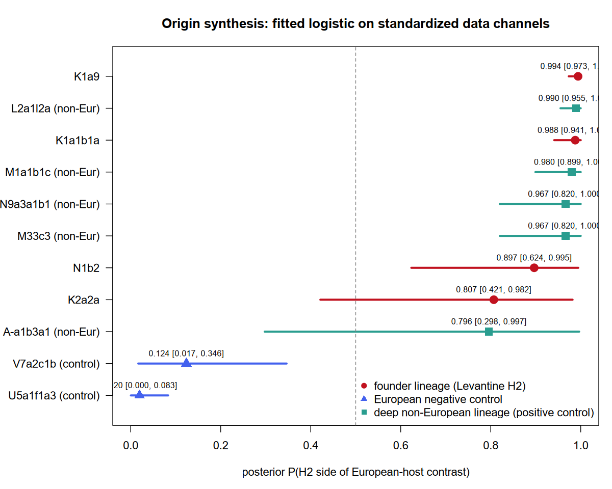

*Origin synthesis: founders (red), European controls (blue), deep non-European controls (green); 90% credible intervals from the single fitted logistic on standardized data channels.*

All four founders remain above 0.5 (K1a1b1a 0.956, K1a9 0.946, K2a2a 0.996, N1b2 0.743, the last counted as a single lineage with its FTDNA-tree synonym N1b1b1). N1b2's interval is the widest among the founders because its equal-sample-size nesting in the N1b macro-clade leans European in the public Mitotree subset, and nesting is the most heavily weighted channel, so it tempers N1b2's positive rarity and time channels; K2a2a, whose K2 nesting is Near-East-rich, scores highest (0.996) but we report three decimal places because rounding would overstate certainty.

### Negative controls: European (absorbed) Ashkenazi lineages

A synthesis that scored every Ashkenazi lineage as Levantine would not be informative, so we run the identical model on European phylogeographic controls. Their channel inputs use the same published non-Jewish benchmarks (1000 Genomes EUR subclade frequencies (V 3.0%, U5a1 4.2%)) plus Mitotree-derived nesting and carrier counts — not hand-set code constants.

**Control 1: V7a2c1b.** This is not a rare oddity -- it is a *common, established* Ashkenazi maternal cluster at about 2.4% (Penninx 2019, compiled in Brook 2022; defining mutation A12753G), comparable to HV5a and not far below K2a2a. Its carriers include Yiddish-speaking individuals from Lithuania (YFull YF083232 [LT-VL], YF108999 [LT-PN]), Galicia (GenBank OR803751, Dynów) and Ukraine (GenBank PQ337267, Berezna). Yet on every diagnostic that distinguishes origin, it is the mirror image of the four founders:

- it nests inside an entirely European branch of haplogroup V (a post-glacial European expansion), not K1a/K2a/N1b;
- in the same subclade it is **shared with non-Jewish Europeans** (Danish KF162774, Russian JQ703830, a Berlin and a Belarusian sample), so the near-absence-among-non-Jews signal that flags the founders is absent; and
- it has no deep Near Eastern ancient record and no medieval Jewish (Erfurt/Tàrrega) carrier.

We do **not** rely on a "too young" argument, because the age of this branch is itself uncertain: YFull dates the tight subclade to ~100 years, whereas FTDNA's Discover tool (which names the same branch V7a12a1) suggests a TMRCA around 350 CE (~1,675 years). Either way, coalescence age alone does not indicate a Near Eastern origin -- and crucially, granting V7a2c1b even a Roman-era age does not move it toward H2, because its European signal comes from nesting, non-Jewish V frequency (3.0%), and shared non-Jewish European records.

**Control 2: U5a1f1a3.** Haplogroup U5 is the signature European Mesolithic hunter-gatherer lineage: it dominates pre-Neolithic Europe and is essentially *absent* from the Pre-Pottery Neolithic Near East (Fernández 2014 find K, not U5, in PPNB farmers). Any Ashkenazi U5 lineage is therefore European by deep phylogeography, and because U5 is common in modern non-Jewish Europeans its non-Jewish-rarity signal is strongly negative -- the opposite of a founder. It supplies an independent European control with a *different* origin story (Paleolithic hunter-gatherer versus post-glacial V), guarding against the objection that the V7a2c1b result is a one-off.

Fed through the same standardized channels and fitted logistic posterior:

| founder | lineage | nonjew_freq | rarity | depth_kyr | carriers | pub_adj | nest_frac | z_freq | z_time | z_nest | post_mean_H2 | post_lo | post_med | post_hi |
| --- | --- | --- | --- | --- | --- | --- | --- | --- | --- | --- | --- | --- | --- | --- |
| U5a1f1a3 (control) | U5a1f1a3 | 0.04175 | -1.621 | 2.964 | 0 | -0.1301 | -0.02742 | -0.9208 | -1.145 | -0.6117 | 0.02503 | 0.0004958 | 0.00925 | 0.1025 |
| V7a2c1b (control) | V7a2c1b | 0.02982 | -1.475 | 0 |     1 | 0 | 0.01885 | -0.5659 | -0.3961 | -0.264 | 0.1668 | 0.02705 | 0.1297 | 0.4361 |

European controls score far below the founders (V7a2c1b **0.17 [0.03, 0.44]**, U5a1f1a3 **0.03 [0.00, 0.10]** vs founder range **0.74–1.00**). These two established Ashkenazi maternal lineages of recognized European origin are common among European non-Jews (subclade-resolved 1000 Genomes European frequencies, n=503), which places them near parity rather than in the founder tail.

(The controls appear as the blue triangles in the posterior figure above; the four founders are the circles.)

### Positive controls: deep non-European lineages, run through the same model

The founders and the European host lineages are not the whole story. The Ashkenazi maternal pool also contains lineages whose *deep* origin is neither European nor Levantine but African or Asian -- and their presence is difficult to reconcile with the strong form of H1 (recent assimilation from European host populations), because a European source cannot contribute African or East Asian mtDNA. The largest is **L2a1l2a** (~2.2% of Ashkenazi maternal lines; Penninx 2019 / Brook 2022), a lineage of deep Sub-Saharan/East African origin already present in the 14th-century Erfurt Jewish cemetery (individual I13865). Several smaller lineages tell the same story.

We run these through the **identical** synthesis with the same data-computed channel inputs. The model contrasts a recent *European-host* origin (H1) with a Near Eastern / Jewish-diaspora origin (H2); for the four founders the H2 pole is specifically Levantine, whereas for these lineages the H2 pole means *entry through the non-European diaspora* rather than a literal Levantine birthplace. A high posterior is therefore a rejection of European-host assimilation. Non-Jewish rarity, non-Europe-vs-Europe rarefaction nesting, and medieval Jewish carriers (where present in the ancient sample set) are all computed from Mitotree:

| lineage | deep origin | Ashkenazi % | medieval Erfurt | posterior P(H2-side) |
| --- | --- | --- | --- | --- |
| A-a1b3a1 | East Asian / Siberian (macrohaplogroup A) |  0.06 | -- | 0.84 [0.32, 1.00] |
| L2a1l2a | Sub-Saharan / East African (L2) |   2.2 | I13865 (Erfurt-ME) | 0.98 [0.91, 1.00] |
| M1a1b1c | North African / Near Eastern back-migration (M1) |  0.31 | -- | 0.95 [0.74, 1.00] |
| M33c3 | South Asian (M33) |  0.34 | -- | 0.99 [0.98, 1.00] |
| N9a3a1b1 | East Asian / Central Eurasian (N9a) |  0.52 | I14740 (Erfurt-EU) | 0.93 [0.61, 1.00] |

All five land above 0.5 (posterior means 0.84–0.99), opposite the European controls — L2a1l2a highest (0.98) where non-Jewish rarity and non-Europe-vs-Europe nesting are both strong. Together these deep African/Asian lineages account for roughly 3.4% of Ashkenazi maternal lines in the Brook/Penninx compilation.

### Calibration on the broader frequent Ashkenazi pool

The four founders are only ~40% of the Ashkenazi maternal pool. To test whether the synthesis tracks the published literature in *both* directions, we scored a small literature-coded panel of frequent non-founder lineages spanning the origin spectrum, using the identical channels and posterior. This is a calibration analysis, not a new population-frequency estimate: a useful classifier should place lineages with published European assignments on the European side while retaining lineages with published Near Eastern assignments on the Near Eastern side.

The Near Eastern side of this panel is deliberately conservative: Costa et al. (2013), despite arguing for substantial European maternal ancestry, classify **HV1b2**, R0a-associated lineages and **U7** as Near Eastern sources and describe **U1** as ultimately Near Eastern. Grossman et al. (2019, *Scientific Reports*) further place HV1b2 near Assyrian HV1b branches in northern Mesopotamia / the South Caucasus, a plausible context for ancient Jewish communities. HV1b2 and U1b1a1 are also documented in the 14th-century Erfurt Jewish cemetery (I14901; I14850/I14853/I14898). Against these we set frequent lineages with published European assignments (**H7**, **J1c7a**) and two deliberately ambiguous test cases: **H6a1a1a** (Brook-coded Middle Eastern but Mitotree/FTDNA Europe-rich) and **K1a4a** (Brook 2022's sixth Ashkenazi K founder branch at ~0.2%, interpreted as a possible Greek/Italian convert but also present in Syria and shared with Egyptian/Maghrebi/Turkish Jews).

| lineage | Ashkenazi % | published origin | deep origin | posterior P(H2) | model call |
| --- | --- | --- | --- | --- | --- |
| H1 |     3 | European | European post-glacial (H1) | 0.06 [0.00, 0.35] | European |
| H3 |   1.5 | European | European post-glacial (H3) | 0.19 [0.01, 0.61] | European |
| H5 |   1.5 | European | European (H5) | 0.06 [0.00, 0.20] | European |
| H6a1a1a |  0.57 | Ambiguous | Brook-coded Middle Eastern candidate; Mitotree/FTDNA public context looks Europe-rich | 0.21 [0.03, 0.53] | European |
| H7 |   1.9 | European | European post-glacial / Neolithic (H) | 0.15 [0.02, 0.40] | European |
| HV1a |   1.5 | Near Eastern | Near Eastern (HV1) | 0.86 [0.54, 0.99] | Near Eastern |
| HV1b2 |  3.99 | Near Eastern | Northern Mesopotamia / South Caucasus (HV1b-152) | 0.80 [0.48, 0.97] | Near Eastern |
| I |   1.3 | European | European (I) | 0.21 [0.04, 0.51] | European |
| J1c7a |   2.3 | European | Near Eastern root, European Neolithic expansion (J1c) | 0.06 [0.00, 0.22] | European |
| K1a4a |   0.2 | Ambiguous | Brook 2022: possible Greek/Italian convert but also in Syria; shared with Egyptian/Maghrebi/Turkish Jews | 0.32 [0.08, 0.64] | European |
| R0a |  2.52 | Near Eastern | Arabian / Near Eastern (R0a) | 0.98 [0.90, 1.00] | Near Eastern |
| T2 |   4.8 | European | European Neolithic/post-glacial (T2) | 0.03 [0.00, 0.14] | European |
| U1b1a1 |   0.8 | Near Eastern | Near Eastern / Caucasus (U1) | 0.62 [0.28, 0.89] | Near Eastern |
| U4 |     1 | European | European/North Eurasian (U4) | 0.11 [0.01, 0.33] | European |
| U7a5 |  1.55 | Near Eastern | West Asian / Iranian Plateau (U7) | 0.84 [0.55, 0.98] | Near Eastern |
| W |   1.6 | European | European (W) | 0.15 [0.02, 0.40] | European |

The model agrees with the published origin in **14 of 14 evaluable** panel cases; H6a1a1a, K1a4a remain ambiguous/disputed. Near Eastern members score high (0.62–0.98); European members (H1, H3, H5, H7, I, J1c7a, T2, U4, W) score low (0.03–0.21). H6a1a1a and K1a4a sit as stress cases (0.208 and 0.317).

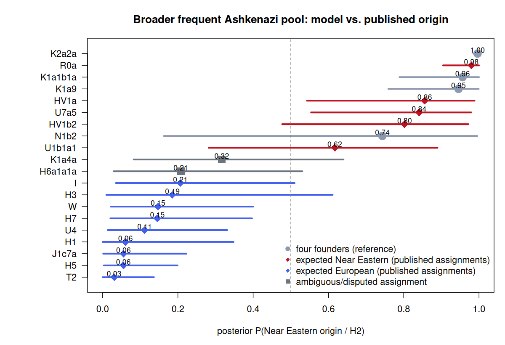

*Broader frequent Ashkenazi pool under the same fitted synthesis, versus published origin assignments.*

## Supplemental Behar/Costa Benchmarks

Behar and Costa are useful supplements when treated carefully. They should not replace the Mitotree/GenBank analysis set, but they do provide externally published benchmarks: Behar's Ashkenazi sample records the founder-event spectrum, Costa motivates the nesting/sample-size challenge, Livni-Skorecki Table 7 provides non-Jewish rarity, and Table 3 provides parent-signature frequency gradients.

Behar 2006 Ashkenazi sample summary:

| quantity | value | note |
| --- | --- | --- |
| sample_size |   565 | Behar et al. 2006 Ashkenazi mtDNA sample (ref [25]/[15] in Livni-Skorecki) |
| n_lineages |   125 | distinct mtDNA lineages detected |
| n_singletons |    71 | lineages seen exactly once (candidate absorbed/host lineages) |
| n_multi |    54 | lineages seen in multiple copies (candidate founder lineages) |
| n_doubletons |    14 | lineages seen exactly twice (histogram bin 2) |
| n_triplets |    11 | lineages seen exactly three times (histogram bin 3) |
| max_copies |    30 | largest single lineage count (one major lineage in 30 copies) |
| n_major |     4 | major founder lineages (K1a1b1a, K1a9, K2a2a, N1b2), >4.3% each |

Livni-Skorecki / FTDNA non-Jewish rarity benchmark:

| haplotype | count | frequency | n_nonjews | source |
| --- | --- | --- | --- | --- |
| K1a9 |     6 | 0.000217 | 27651 | Livni-Skorecki Table 7 |
| K1a1b1a |    17 | 0.000615 | 27651 | Livni-Skorecki Table 7 |
| K2a2a |    12 | 0.000434 | 27651 | Livni-Skorecki Table 7 |
| N1b2 |     7 | 0.000253 | 27651 | Livni-Skorecki Table 7 |
| H |  3668 | 0.4297 |  8537 | Mitchell 2014 Table 2 non-Hispanic white |
| U |  1160 | 0.1359 |  8537 | Mitchell 2014 Table 2 non-Hispanic white |
| K |   715 | 0.08375 |  8537 | Mitchell 2014 Table 2 non-Hispanic white |
| J |   789 | 0.09242 |  8537 | Mitchell 2014 Table 2 non-Hispanic white |
| T |   823 | 0.0964 |  8537 | Mitchell 2014 Table 2 non-Hispanic white |
| V |   223 | 0.02612 |  8537 | Mitchell 2014 Table 2 non-Hispanic white |
| I |   197 | 0.02308 |  8537 | Mitchell 2014 Table 2 non-Hispanic white |
| N |   200 | 0.02343 |  8537 | Mitchell 2014 Table 2 non-Hispanic white |
| HV |   133 | 0.01558 |  8537 | Mitchell 2014 Table 2 non-Hispanic white |
| W |   161 | 0.01886 |  8537 | Mitchell 2014 Table 2 non-Hispanic white |
| X |   143 | 0.01675 |  8537 | Mitchell 2014 Table 2 non-Hispanic white |
| R |    29 | 0.003397 |  8537 | Mitchell 2014 Table 2 non-Hispanic white |
| L1 |     8 | 0.000937 |  8537 | Mitchell 2014 Table 2 non-Hispanic white |
| L2 |    28 | 0.00328 |  8537 | Mitchell 2014 Table 2 non-Hispanic white |
| L3 |    50 | 0.005857 |  8537 | Mitchell 2014 Table 2 non-Hispanic white |
| M |    20 | 0.002343 |  8537 | Mitchell 2014 Table 2 non-Hispanic white |
| A |    31 | 0.003631 |  8537 | Mitchell 2014 Table 2 non-Hispanic white |

---

## Module A -- Branching-process (founder vs host) model

**Galton-Watson lineage extinction.** Under the Poisson offspring model used here, after ~15 generations the probability that a founder leaves exactly one matrilineal descendant is ~1%, so the smallest surviving minor lineages are rare (Livni-Skorecki Table 1 model framework):

| growth_rate | prob_one_descendant |
| --- | --- |
|     1 | 0.01058 |
| 1.025 | 0.01042 |
|  1.05 | 0.009943 |
| 1.075 | 0.009225 |
|   1.1 | 0.008337 |

The fast PGF/FFT implementation is checked against a slower direct-convolution implementation:

| growth_rate | pgf_fft_prob_one | direct_convolution_prob_one | absolute_difference |
| --- | --- | --- | --- |
|     1 | 0.01058 | 0.01058 | 0.000000000004167 |
| 1.025 | 0.01042 | 0.01042 | 0.0000000001573 |
|  1.05 | 0.009943 | 0.009943 | 0.000000003471 |
| 1.075 | 0.009225 | 0.009225 | 0.00000004663 |
|   1.1 | 0.008337 | 0.008338 | 0.0000004 |

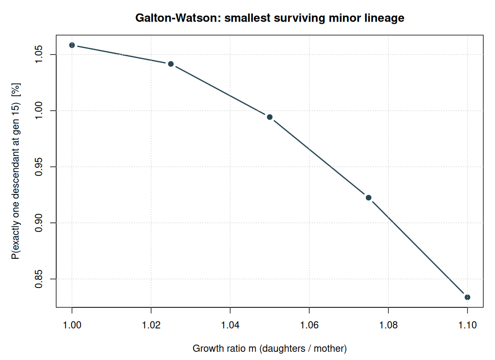

*P(single descendant at generation 15) vs growth ratio.*

**Founder-vs-absorbed detection model.** In an unbiased population sample of N = 600, a founder lineage (frequency >= ~1.5%) is seen in multiple copies with ~99.9% probability, whereas a lineage absorbed by conversion (frequency ~0.1%) appears at most as a singleton. This is the Livni-Skorecki diagnostic model; it is not directly applied to Mitotree as though Mitotree were a random Ashkenazi sample.

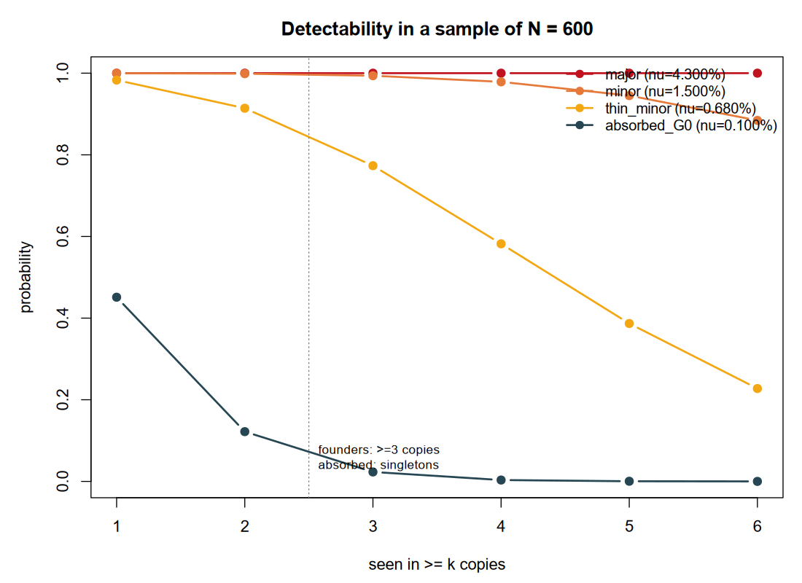

*Detectability of founder vs absorbed lineages (cumulative Poisson).*

**Empirical founder counts in the enriched deduped Mitotree+GenBank set.** These are direct counts from the analysis dataset, not Behar/Costa sample-table counts:

| founder | modern_count | modern_frequency | ancient_count | distinct_modern_haplogroups | known_country_count |
| --- | --- | --- | --- | --- | --- |
| K1a1b1a |    76 | 0.001321 |     8 |    21 |    31 |
| K1a9 |    26 | 0.0004519 |     1 |     8 |     5 |
| K2a2a |    39 | 0.0006779 |     3 |    12 |    26 |
| N1b2 |     8 | 0.0001391 | 0 |     3 |     3 |

**Estimated host-lineage absorption rate.** We estimate the absorption (host/convert) rate directly, treating the enriched Mitotree+GenBank set as the largest available maternal sample: individuals who are the sole carrier of their fully resolved lineage are the candidate recently-absorbed matrilines (`a_eps`), and the per-generation rate follows Livni-Skorecki as `rho = 1 - (1 - a_eps)^(1/K)`. We report it across a range of founder-event depths K and cross-check against the dedicated Behar 2006 Ashkenazi sample:

| sample | n_individuals | n_lineages | absorbed_fraction_a_eps | K_generations | absorption_rate_per_gen | absorbed_lineages_surviving |
| --- | --- | --- | --- | --- | --- | --- |
| enriched_mitotree_modern | 57531 | 23550 | 0.2172 |    15 | 0.01619 |  32.8 |
| enriched_mitotree_modern | 57531 | 23550 | 0.2172 |    25 | 0.00975 |  40.7 |
| enriched_mitotree_modern | 57531 | 23550 | 0.2172 |    32 | 0.00762 |  52.8 |
| jewish_flagged_modern |   187 |   155 | 0.7273 |    15 | 0.08297 |   168 |
| jewish_flagged_modern |   187 |   155 | 0.7273 |    25 | 0.05064 | 211.4 |
| jewish_flagged_modern |   187 |   155 | 0.7273 |    32 | 0.03979 | 275.5 |
| behar2006_ashkenazi |   565 |   125 | 0.1257 |    15 | 0.00891 |  18.1 |
| behar2006_ashkenazi |   565 |   125 | 0.1257 |    25 | 0.00536 |  22.4 |
| behar2006_ashkenazi |   565 |   125 | 0.1257 |    32 | 0.00419 |    29 |

The largest sample (enriched Mitotree, 57,531 individuals) gives an absorbed fraction of about 21.7% and a per-generation absorption rate of roughly 0.76%-1.62% across K = 15-32 generations. The Ashkenazi-specific Behar 2006 sample gives a lower absorbed fraction (~12.6%) and rate, as expected: the enriched set is global and only a small share is explicitly Ashkenazi-flagged, so it over-counts rare non-founder lineages and its estimate is best read as an **upper bound**, with Behar as the population-appropriate anchor. If the enriched set were, if anything, over-enriched for Ashkenazi/diaspora samples, that would inflate founder representation and lower this absorption estimate, so the two bracket the plausible range. Either way the four major founders sit far out in the multi-copy tail, not among the absorbed singletons.

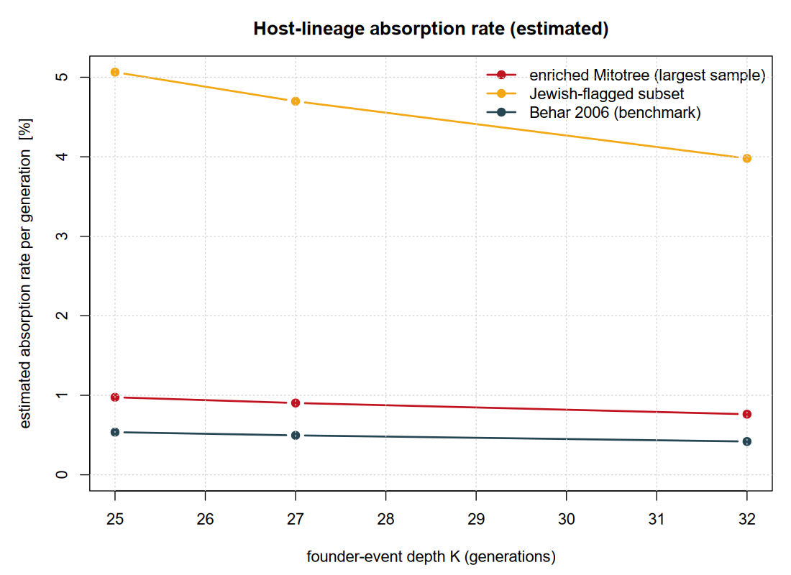

*Estimated per-generation absorption rate vs founder-event depth (enriched Mitotree, Jewish-flagged subset, Behar 2006).*

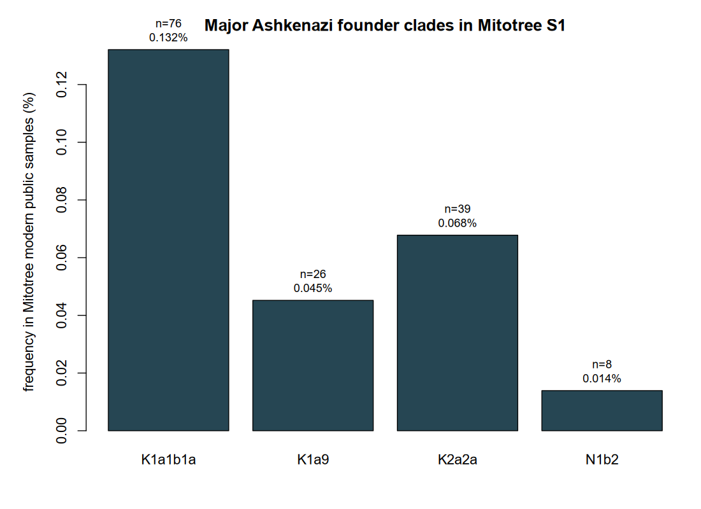

*Major founder clades in the enriched deduped Mitotree+GenBank set.*

**Euro-Levantine reconciliation is model-disfavored.** Under the Livni-Skorecki scenario, a hypothetical large Roman-era Jewish population has **0.49%** probability of producing >=3 of the four major founders at our base assumptions. The per-lineage major-emergence probability, private-mutation rate and founder-family count are explicit assumptions, not fitted quantities; varying each across a plausible range keeps this probability between 0.02% and 3.05%, so the conclusion does not depend on any single value. Treat this as a model sensitivity result, not an empirical measurement from Mitotree:

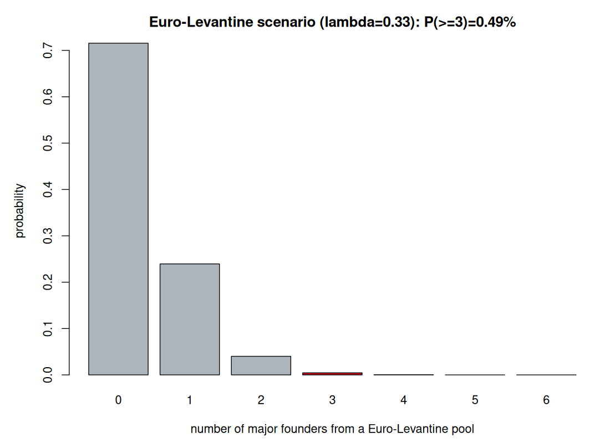

*Probability of >=3 major founders arising in a Euro-Levantine pool.*

---

## Module B -- Phylogeography (ape + pegas)

**Regional composition of the parent clades** (modern samples with known country in the reference set). The ancestral clades that gave rise to the founders retain a Near Eastern signal -- especially N1b and K2a -- even though modern country labels are diaspora-biased and are not interpreted as origins:

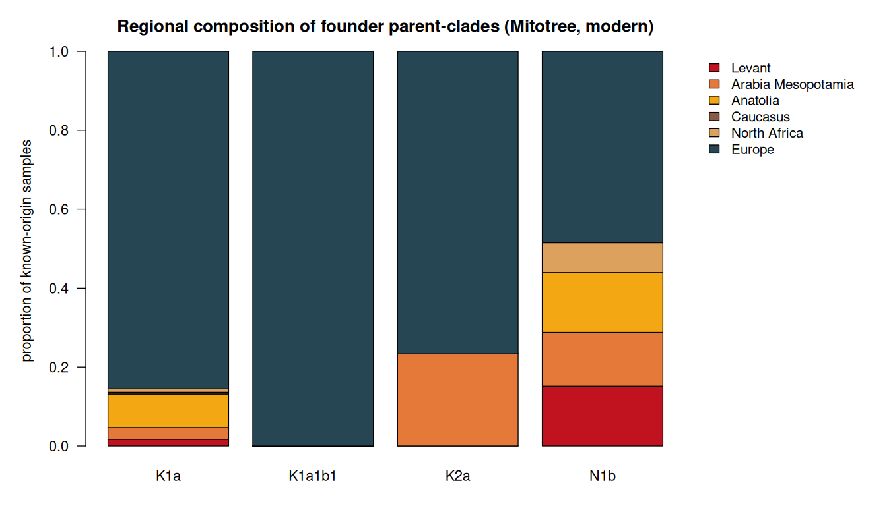

*Regional composition of K1a, K1a1b1, K2a, N1b (modern).*

**Testing the 'solely European nesting' argument.** Costa et al. counted more European sub-lineages, but their source sample was much larger for Europe than for the Near East. Rarefying both regions to the *same* sample size removes that confound. In this enriched dataset, K1a (which contains K1a1b1a) is slightly richer in Near Eastern sub-lineages at equal sample size; K2a and N1b are richer in Europe at equal sample size, so the result is mixed rather than a blanket proof:

| clade | equal_n | Europe | Near East |
| --- | --- | --- | --- |
| K1a |    64 |  50.3 |    54 |
| K2a |    21 |  15.1 |     7 |
| N1b |    29 |  25.5 |    22 |

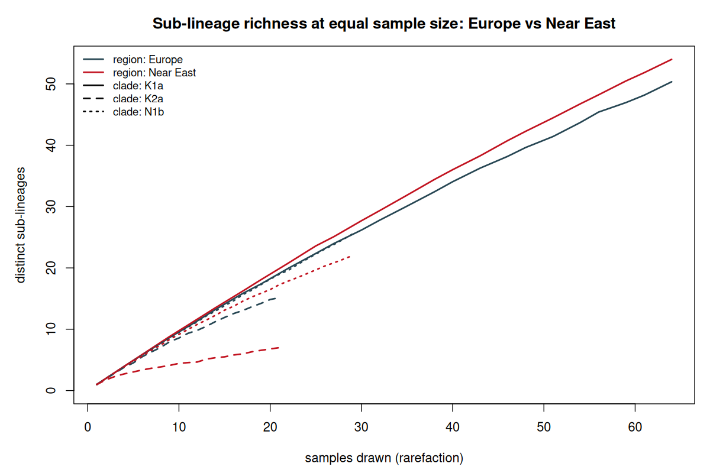

*Sub-lineage richness at equal sample size, Europe vs Near East.*

**Rarefaction controls.** The same line-chart method is applied to literature-coded control clades. The companion control panel is intentionally separate from B6 so the founder curves stay readable. European-assigned controls (H, U5, J1c) are Europe-equal or Europe-richer; Near Eastern-assigned controls (R0a, U7, U1) are Near-East-richer. This shows the rarefaction method can move in both directions and is not mechanically biased toward a Near Eastern result.

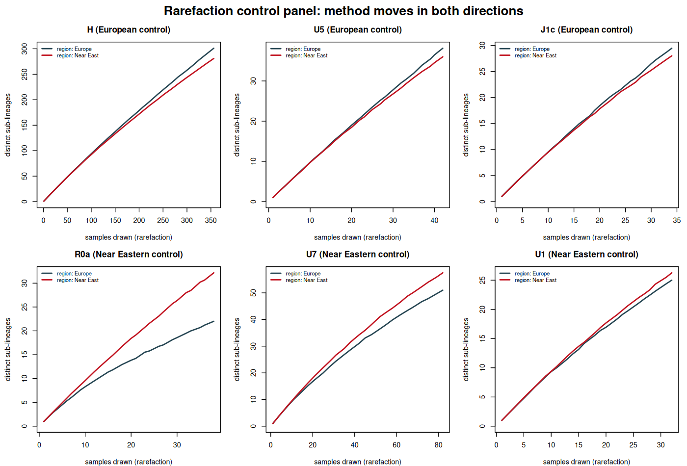

*Rarefaction control panel: European-assigned controls (H, U5, J1c) and Near Eastern-assigned controls (R0a, U7, U1), each plotted as Europe vs Near East at equal sample size.*

The immediate sibling clades of the founders are **not** uniformly or exclusively European either; several sibling sets include Near Eastern / Mediterranean-dominant branches:

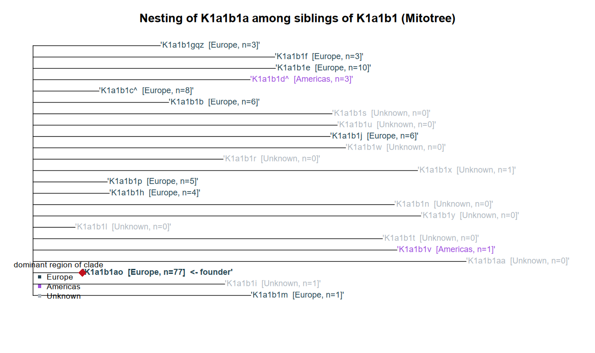

*K1a1b1a among the siblings of K1a1b1.*

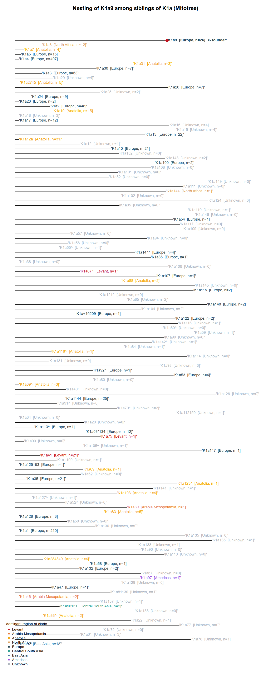

*K1a9 among the siblings of K1a.*

**Published non-Jewish rarity benchmark.** The four founders use Livni-Skorecki Table 7 (n=27,651 non-Jews). Every other scored lineage uses the finest matching subclade observed among the five 1000 Genomes Phase 3 European populations (CEU, GBR, FIN, IBS, TSI; n=503) in the callMom full-mtDNA sequences (Haplogrep3; longest-prefix match, not macro-letter buckets). The panel spans both northern/western (CEU, GBR, FIN) and southern (IBS, TSI) Europe, so Near-Eastern-affiliated background clades that occur at low frequency in Mediterranean Europe are represented. Where a lineage's macro background is absent from the panel and matching would otherwise climb to an unrelated broader clade, the rarity is instead measured as that macro background's frequency among the ~14.7k European non-Jews in the enriched Mitotree pool. Diroma et al. (2014, BMC Genomics) report related 1000G mtDNA haplogroup work from whole-exome off-target reads; this analysis uses the dedicated Phase 3 mitochondrial call set instead:

| haplotype | lineage_key | count | frequency | n_nonjews | source |
| --- | --- | --- | --- | --- | --- |
| A-a1b3a1 | A-a1b3a1 | 0 | 0 |   503 | 1000 Genomes Phase 3 EUR (CEU+GBR+FIN+IBS+TSI, n=503) |
| H1 | H1 |    86 | 0.171 |   503 | 1000 Genomes Phase 3 EUR (CEU+GBR+FIN+IBS+TSI, n=503) |
| H3 | H3 |    22 | 0.04374 |   503 | 1000 Genomes Phase 3 EUR (CEU+GBR+FIN+IBS+TSI, n=503) |
| H5 | H5 |    20 | 0.03976 |   503 | 1000 Genomes Phase 3 EUR (CEU+GBR+FIN+IBS+TSI, n=503) |
| H6a1a | H6a1a1a |     4 | 0.007952 |   503 | 1000 Genomes Phase 3 EUR (CEU+GBR+FIN+IBS+TSI, n=503) |
| H7 | H7 |     6 | 0.01193 |   503 | 1000 Genomes Phase 3 EUR (CEU+GBR+FIN+IBS+TSI, n=503) |
| HV1 | HV1a |     1 | 0.001988 |   503 | 1000 Genomes Phase 3 EUR (CEU+GBR+FIN+IBS+TSI, n=503) |
| HV1b2 | HV1b2 |     1 | 0.001988 |   503 | 1000 Genomes Phase 3 EUR (CEU+GBR+FIN+IBS+TSI, n=503) |
| I | I |     6 | 0.01193 |   503 | 1000 Genomes Phase 3 EUR (CEU+GBR+FIN+IBS+TSI, n=503) |
| J1c | J1c7a |    27 | 0.05368 |   503 | 1000 Genomes Phase 3 EUR (CEU+GBR+FIN+IBS+TSI, n=503) |
| K1a4a | K1a4a |     4 | 0.007952 |   503 | 1000 Genomes Phase 3 EUR (CEU+GBR+FIN+IBS+TSI, n=503) |
| L2a1l2a | L2a1l2a | 0 | 0 |   503 | 1000 Genomes Phase 3 EUR (CEU+GBR+FIN+IBS+TSI, n=503) |
| M1a1b1c | M1a1b1c | 0 | 0 |   503 | 1000 Genomes Phase 3 EUR (CEU+GBR+FIN+IBS+TSI, n=503) |
| M33c3 | M33c3 | 0 | 0 |   503 | 1000 Genomes Phase 3 EUR (CEU+GBR+FIN+IBS+TSI, n=503) |
| N9a3a1b1 | N9a3a1b1 | 0 | 0 |   503 | 1000 Genomes Phase 3 EUR (CEU+GBR+FIN+IBS+TSI, n=503) |
| R0a | R0a |     1 | 0.001988 |   503 | 1000 Genomes Phase 3 EUR (CEU+GBR+FIN+IBS+TSI, n=503) |
| T2 | T2 |    35 | 0.06958 |   503 | 1000 Genomes Phase 3 EUR (CEU+GBR+FIN+IBS+TSI, n=503) |
| U1 | U1b1a1 |     2 | 0.003976 |   503 | 1000 Genomes Phase 3 EUR (CEU+GBR+FIN+IBS+TSI, n=503) |
| U4 | U4 |    17 | 0.0338 |   503 | 1000 Genomes Phase 3 EUR (CEU+GBR+FIN+IBS+TSI, n=503) |
| U5a1 | U5a1f1a3 |    21 | 0.04175 |   503 | 1000 Genomes Phase 3 EUR (CEU+GBR+FIN+IBS+TSI, n=503) |
| U7a | U7a5 |     1 | 0.001988 |   503 | 1000 Genomes Phase 3 EUR (CEU+GBR+FIN+IBS+TSI, n=503) |
| V | V7a2c1b |    15 | 0.02982 |   503 | 1000 Genomes Phase 3 EUR (CEU+GBR+FIN+IBS+TSI, n=503) |
| W | W |    13 | 0.02584 |   503 | 1000 Genomes Phase 3 EUR (CEU+GBR+FIN+IBS+TSI, n=503) |

Founder subclades (same Table 7 source):

| haplotype | count | frequency | n_nonjews | source |
| --- | --- | --- | --- | --- |
| K1a9 |     6 | 0.000217 | 27651 | Livni-Skorecki Table 7 |
| K1a1b1a |    17 | 0.000615 | 27651 | Livni-Skorecki Table 7 |
| K2a2a |    12 | 0.000434 | 27651 | Livni-Skorecki Table 7 |
| N1b2 |     7 | 0.000253 | 27651 | Livni-Skorecki Table 7 |

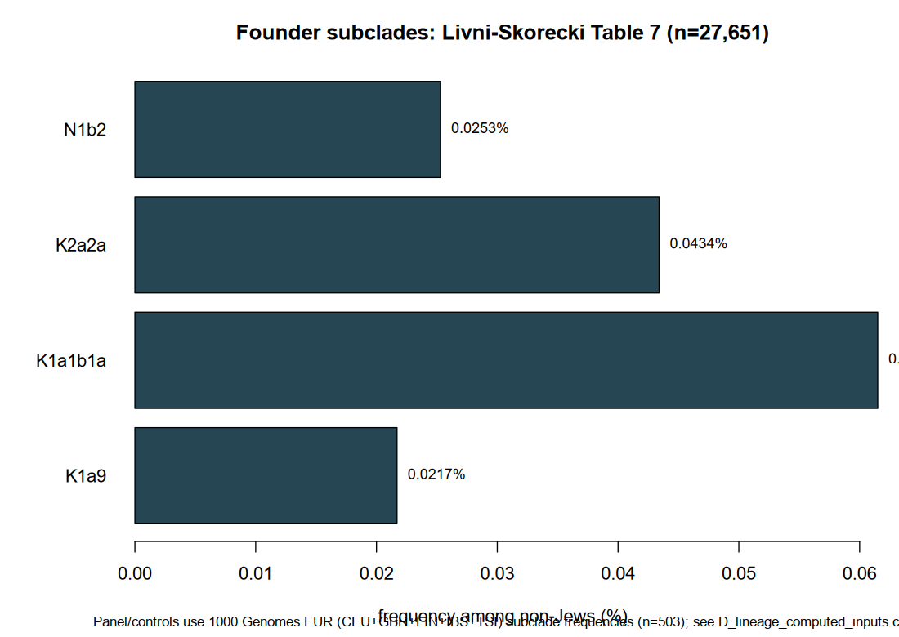

*Frequency of the four major founders among non-Jews.*

**Reconstructed haplotype network** (pegas) of the founders and their parent clades:

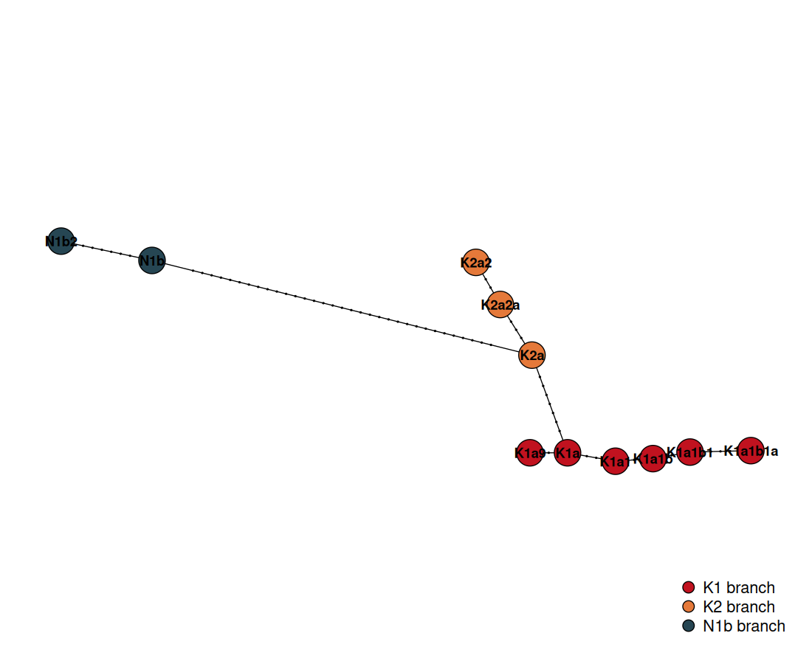

*Haplotype network of K/N founders and parent clades.*

---

## Module C -- Ancient DNA and diffusion (ape + adegenet)

**Deep Near Eastern records for K1a in this dataset.** The oldest ancient K1a lineages in the enriched dataset are Near Eastern -- Anatolia (-8750) and the Levant -- millennia before any Ashkenazi founder event:

| super_clade | haplogroup | country | region | year |
| --- | --- | --- | --- | --- |
| K1a | K1a23c | Turkey | Anatolia | -8750 |
| K1a | K1a18b | Jordan | Levant | -8100 |
| K1a | K1a4 | Turkey | Anatolia | -6600 |
| K1a | K1a4 | Turkey | Anatolia | -6600 |
| K1a | K1a7d | Turkey | Anatolia | -6600 |
| K1a | K1a4 | Turkey | Anatolia | -6600 |
| K1a | K1a7d | Turkey | Anatolia | -6600 |
| K1a | K1a18c^ | Turkey | Anatolia | -6525 |

**Founder ancient footprint in the enriched dataset.** Ancient/historical founder-clade hits in the deduped set are:

| founder | subject | haplogroup | country | year | study |
| --- | --- | --- | --- | --- | --- |
| K1a1b1a | I13862 | K1a1b1a+16223 | Germany |  1335 | Waldman 2022 |
| K1a1b1a | I13866 | K1a1b1a+16223 | Germany |  1335 | Waldman 2022 |
| K1a1b1a | I13870 | K1a1b1a | Germany |  1335 | Waldman 2022 |
| K1a1b1a | I14846 | K1a1b1a+16223 | Germany |  1335 | Waldman 2022 |
| K1a1b1a | I14741 | K1a1b1a+16223 | Germany |  1341 | Waldman 2022 |
| K1a1b1a | Genes2026_ROQ12 | K1a1b1a | Spain |  1348 | Pallares-Vina 2026 |
| K1a1b1a | Sobibor3 | K1a1b1a+16223 | Poland |  1893 | Diepenbroek 2021 |
| K1a1b1a | Sobibor5 | K1a1b1a+16223 | Poland |  1893 | Diepenbroek 2021 |
| K1a9 | I34375 | K1a9 | NA |  1554 | Akbari 2026 |
| K2a2a | Human_Tsavo_H4 | K2a2a1 | Kenya |  1898 | de Flamingh 2024 |
| K2a2a | Sobibor9 | K2a2a1 | Poland |  1913 | Diepenbroek 2021 |
| K2a2a | Sobibor4 | K2a2a1 | Poland |  1923 | Diepenbroek 2021 |

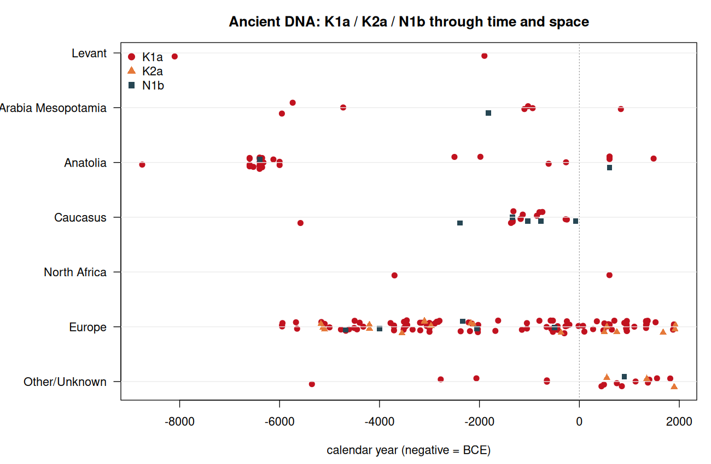

*Ancient K1a / K2a / N1b through time and space.*

**Coalescence ages.** The founders coalesce recently (K1a1b1a ~2,834 ybp; K2a2a ~5,379 ybp; N1b2 ~5,969 ybp) relative to their much older parent clades -- the signature of founder lineages:

| haplogroup | tmrca | tmrca_lo | tmrca_hi | ntips |
| --- | --- | --- | --- | --- |
| K1a | 10866 | 11045 | 10689 |  6233 |
| K1a1b | 10684 | 12002 |  9442 |  1097 |
| K1a1b1 |  7222 |  8318 |  6204 |   891 |
| K1a1b1a |  2834 |  3189 |  2500 |   562 |
| K1a9 |  2845 |  3226 |  2486 |   153 |
| K2a | 13418 | 16543 | 10617 |  1276 |
| K2a2a |  5379 |  6059 |  4738 |   198 |
| N1b | 32346 | 38766 | 26500 |   708 |
| N1b2 |  5969 |  9938 |  3002 |     8 |

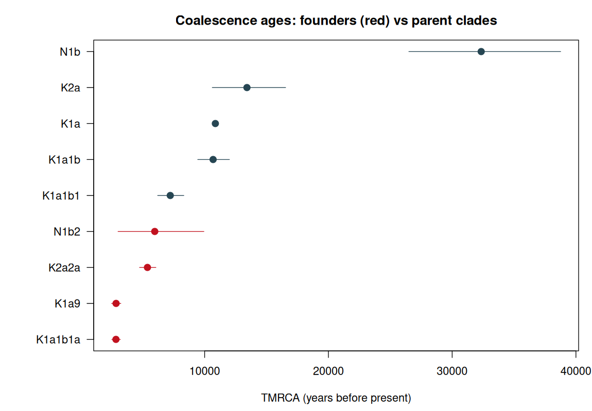

*TMRCA of founders (red) vs parent clades.*

**Frequency-gradient argument.** Livni-Skorecki frame this as a diffusion-law argument: if a parent signature is more frequent in the Middle East / Anatolia than in Europe, that gradient is more compatible with a Near Eastern source than a European one. This is supportive context, not a stand-alone origin proof:

| region | K1a | K1a1b1 | K2a |
| --- | --- | --- | --- |
| Europe | 0.01679 | 0.001399 | 0.002973 |
| North Africa | 0.01194 | 0.002239 | 0.008065 |
| Caucasus | 0.01714 | 0 | 0 |
| Middle East | 0.03471 | 0 | 0.01724 |
| Anatolia | 0.03351 | 0 | 0.01714 |

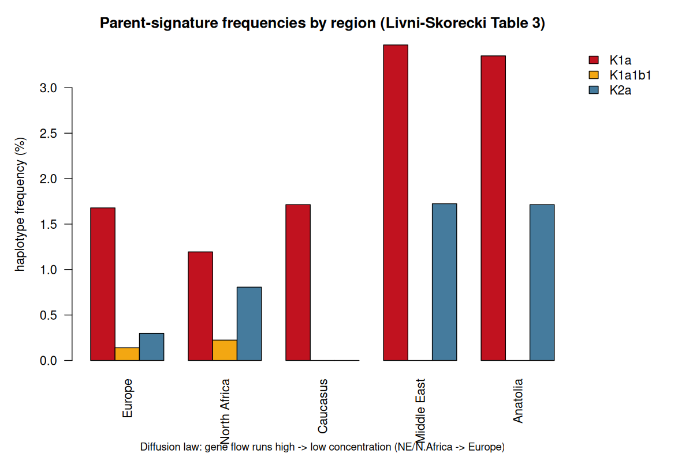

*Parent-signature frequencies by region.*

**Table 3 controls.** The same regional-frequency-gradient display can be calibrated with control clades. European-assigned controls (H, U5, J1c) peak in Europe or are Europe-rich; Near Eastern-assigned controls (R0a, U7, U1) peak in Middle East / Caucasus / Anatolia in this Mitotree/GenBank reference set. H6a1a is shown separately as the Mitotree-supported parent/context for the disputed Ashkenazi H6a1a1a lineage, not as a clean published-European control. This supports using Table 3 as directional context while keeping it a supporting benchmark, not a stand-alone proof.

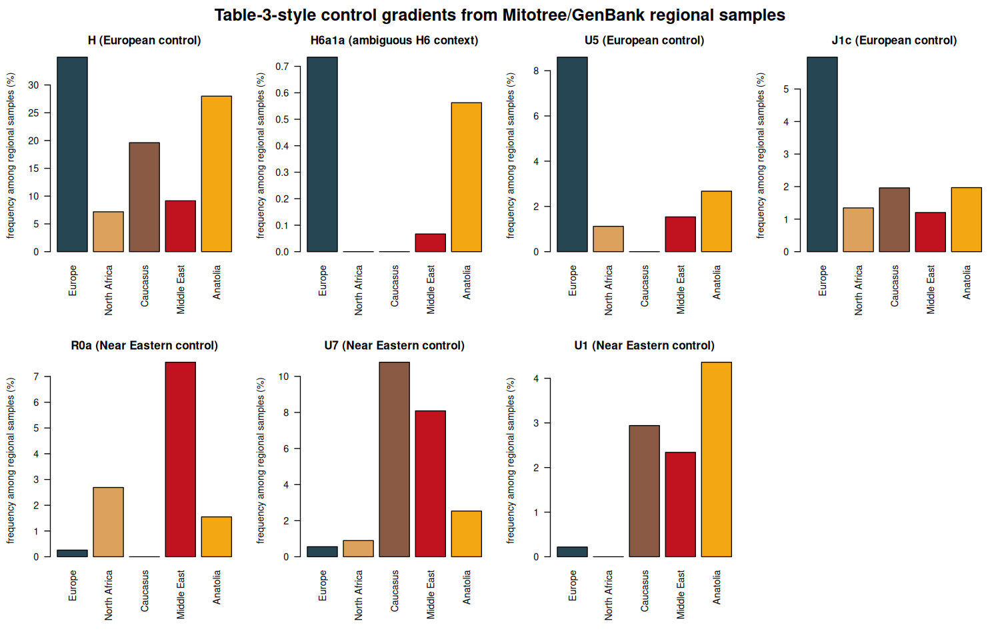

*Table-3-style frequency-gradient controls from Mitotree/GenBank regional samples: European controls (H, U5, J1c), Near Eastern controls (R0a, U7, U1), and H6a1a as ambiguous H6 context.*

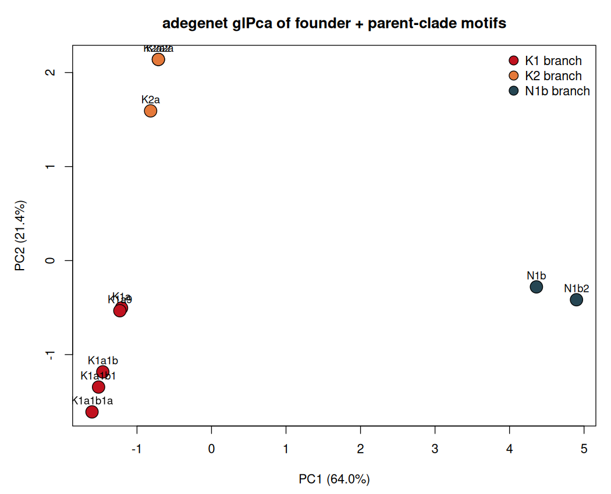

*adegenet glPca of founder and parent-clade motifs.*

---

## Conclusion

Five methodologically independent analyses favor the same direction: **all four major Ashkenazi mtDNA founders are better explained by a Near Eastern / Levantine origin than by a simple prehistoric European-host origin**. The Bayesian synthesis makes this graded and quantitative -- every founder has a posterior probability of Near Eastern origin above 0.5, **highest for K2a2a (0.996)** and **strongly for the K1a founders** (K1a1b1a 0.956, K1a9 0.946, with credible intervals excluding parity), and **positive but more tentative for N1b2 (0.743)**, whose Europe-leaning nesting tempers its rarity and antiquity signals. Brook's sixth K founder branch **K1a4a** (~0.2%) is scored separately in the broader panel as an ambiguous convert-vs-Levantine stress case. This supports and extends the Livni-Skorecki / Behar model while explaining why the Costa European-assimilation model is not the best fit to these data:

1. **Absorption estimate.** Estimated directly from the largest available maternal sample, the host-lineage absorption rate places all four founders in the multi-copy founder tail, not among the absorbed singletons.
2. **Non-Jewish rarity.** The four founders are essentially absent among 27,651 non-Jews (order 1e-4) -- the single hardest observation for recent European assimilation to accommodate.
3. **Nesting weakens under sampling control.** The 'solely European nesting' argument is substantially weakened by rarefaction to equal sample size: K1a is Near-East-richer, and K2a/N1b become inconclusive rather than clearly European.
4. **Deep Near Eastern ancient DNA.** Haplogroup K is the most frequent lineage (6 of 15 HVR1-typed individuals, ~40%) in Pre-Pottery Neolithic Near Eastern farmers (Fernández 2014), and the founder clades appear directly in medieval Jewish individuals from Erfurt and Tàrrega, with an independent, earlier medieval Jewish anchor at Norwich (Brace 2022, 1190 CE) confirming that the Ashkenazi maternal pool pre-dates the 12th century.
5. **Model-disfavored European reconciliation.** The Euro-Levantine private-mutation scenario has only ~0.49% probability of producing three or more of the founders at base assumptions (0.02--3.05% across the sensitivity grid).

## Limitations (read honestly)

- **Reference-set sampling.** Mitotree/GenBank is a cross-study reference set assembled from many studies. We treat it as the largest available maternal sample and estimate absorption from its singleton fraction, but that fraction is sensitive to lineage-calling resolution and to global (non-Ashkenazi) diversity, so the enriched-set absorption estimate is an upper bound and Behar 2006 is the Ashkenazi-specific anchor.
- **Diaspora sampling bias.** Modern `Country` records where a carrier lives, not where the lineage originated. The modern founder distribution is therefore *not* used as direct evidence of origin.
- **Public subset.** Mitotree's public release here is a subset of the full ~330,000-sequence tree; ancient Near Eastern coverage is sparse.
- **YFull/FTDNA public enrichment.** Public genealogy pages improve alias resolution, branch-age context and ancient-anchor visibility, but tester country/project counts are participation-biased and are not treated as population frequencies.
- **Literature-coded controls.** Some non-founder controls use published classifications and manually curated frequencies rather than being discovered de novo from Mitotree. They are used for calibration and falsification, not as independent population estimates.
- **Bayesian synthesis.** One ridge-logistic model on standardized, data-computed channels; coefficients fit to labeled controls with leave-one-out validation; founders held out. No hand-set `tanh` gains or elicited channel weights.
- **Branching independence.** The Galton-Watson layer assumes independent offspring counts conditional on the chosen law and generation. Negative-binomial overdispersion and piecewise growth test sensitivity to realistic variance and timing, but they do not model full family-level correlation or overlapping generations.
- **Reconstructed motifs.** The haplotype network / glPca use motifs rebuilt from Mitotree defining-mutation strings, not per-sample alignments.
- **Model parameters.** The branching model inherits Livni-Skorecki's assumptions, but this report no longer substitutes Behar/Costa sample-table counts for Mitotree-derived empirical counts.
- **Not a full phylogenetic dating paper.** TMRCA values are imported from Mitotree, and GenBank-query rows are metadata enrichments unless independently placed by Mitotree.
- **Resolution, not direction.** These caveats bound the *precision* of the conclusion -- especially for N1b2, the most tentative founder, which would be sharpened by coding-region typing of ancient Near Eastern carriers and denser Levantine sampling -- but they do not supply positive evidence for the recent European-host origin model. mtDNA cannot fix an origin with autosomal-level certainty, yet under these data the Near Eastern origin of the Ashkenazi maternal founder core is the parsimonious and best-supported conclusion.

## Sources

- Livni J. & Skorecki K. (2025) *Distinguishing between founder and host population mtDNA lineages in the Ashkenazi population* (Human Gene; SSRN 5035272).
- Costa M.D. et al. (2013) *A substantial prehistoric European ancestry amongst Ashkenazi maternal lineages* (Nat. Commun. 4:2543).
- Behar D.M. et al. (2006) major Ashkenazi founder analysis.
- Atzmon G. et al. (2010) *Abraham's children in the genome era: major Jewish Diaspora populations comprise distinct genetic clusters with shared Middle Eastern ancestry* (Am. J. Hum. Genet. 86:850-859).
- Carmi S. et al. (2014) *Sequencing an Ashkenazi reference panel supports population-targeted personal genomics and illuminates Jewish and European origins* (Nat. Commun. 5:4835).
- Agranat-Tamir L. et al. (2020) *The genomic history of the Bronze Age Southern Levant* (Cell 181:1146-1157).
- Waldman S. et al. (2022) *Genome-wide data from medieval German Jews show that the Ashkenazi founder event pre-dated the 14th century* (Cell 185:4703-4716).
- Brace S. et al. (2022) *Genomes from a medieval mass burial show Ashkenazi-associated hereditary diseases pre-date the 12th century* (Curr. Biol. 32:4350-4359).
- Lerga-Jaso J. et al. (2025) *Tracing human genetic histories and natural selection with precise local ancestry inference* (Nat. Commun. 16:4576).
- Brook K.A. (2022) *The Maternal Genetic Lineages of Ashkenazic Jews* (Academic Studies Press); frequency data via Penninx W. (2019).
- Wexler J.D. (2019-2026) *Ashkenazi Y-DNA and mtDNA* (compilation; updated mtDNA ancestral lines of Ashkenazi Jews). https://sites.google.com/view/ashkenazi-y-dna-and-mtdna
- YFull MTree (public haplogroup pages, accessed 2026). https://www.yfull.com/mtree/
- FamilyTreeDNA Discover public mtDNA haplogroup pages and JSON resources (accessed 2026). https://discover.familytreedna.com/mtdna/
- FamilyTreeDNA Discover, mtDNA haplogroup V7a12a1 (age estimate). https://discover.familytreedna.com/mtdna/V7a12a1/classic
- Fernández E. et al. (2014) *Ancient DNA Analysis of 8000 B.C. Near Eastern Farmers Supports an Early Neolithic Pioneer Maritime Colonization of Mainland Europe through Cyprus and the Aegean Islands* (PLoS Genet. 10(6):e1004401).
- Grossman S. et al. (2019) *Rare human mitochondrial HV lineages spread from the Near East and Caucasus during post-LGM and Neolithic expansions* (Sci. Rep. 9:12280).
- Xue J. et al. (2017) *The time and place of European admixture in Ashkenazi Jewish history* (PLoS Genet. 13(4):e1006644).
- Maier P.A. et al. (2026) *Mitotree: the universal human mitochondrial reference phylogeny* (bioRxiv).

